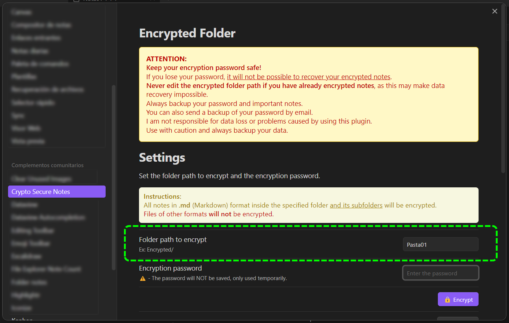
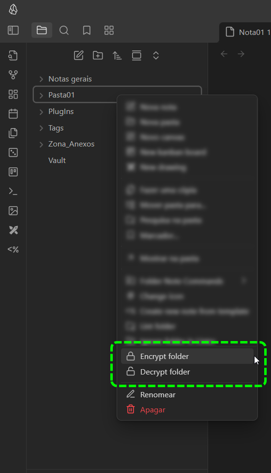
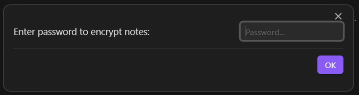

# 🔐 Obsidian Encryptor Secure Notes

 Proteja suas notas Markdown com criptografia moderna, backup de senha por email e interface intuitiva.

## Funcionalidades

- Criptografa/descriptografa todas as notas `.md` de uma pasta.
- Backup da senha por email (mailto, manual, seguro).
- Interface simples e acessível.
- Algoritmos seguros: AES-GCM 256 bits, PBKDF2 + SHA-256.
- Não armazena sua senha.

---

## Como Usar

1. Instale e configure o plugin no Obsidian.
2. Acesse o painel de configurações do plugin.
3. Defina:
   - O caminho da pasta a ser protegida.
   - A senha de criptografia.
4. (Opcional) Informe um email para backup da senha.
5. Clique com o botão direito na pasta e escolha **Criptografar** ou **Descriptografar**.
6. Após criptografar, se o email de backup estiver preenchido, o cliente de email será aberto para envio manual da senha.

> ℹ️ - O conteudo dos arquivos criptografados são identificados com o prefixo `ENCRYPTED::`.

> ❌ - Não edite notas criptografadas identificados com o prefixo `ENCRYPTED::`, pois irá corromper a nota.

### Configuração e menu de contexto

- Configure o endereço da pasta a ser criptografada

<div align="center">
    
</div>

- Ao clicar com o botão direito do mouse na pasta correspondente, a opções serão visiveis no menu de contexto.

<div align="center">
    
    
</div>

---

## Recomendações de Segurança

- Senha nunca é salva pelo plugin.
- O conteudo do arquivos criptografados recebem o prefixo `ENCRYPTED::`.
- Guarde sua senha em local seguro.
- O plugin **não armazena sua senha** permanentemente.

---

## 🔐 Segurança da Criptografia

A criptografia utilizada neste plugin segue práticas modernas e seguras:

- **AES-GCM (256 bits)**: Algoritmo de criptografia simétrica que garante confidencialidade e integridade dos dados.
- **PBKDF2 + SHA-256**: Utilizado para derivar a chave a partir da senha fornecida pelo usuário, com **100.000 iterações**.

Proteções implementadas

- **IV aleatório**: Um novo vetor de inicialização (IV) de 12 bytes é gerado para cada nota, como exigido pelo padrão AES-GCM.

---

## Build e Instalação Manual

Siga os passos abaixo para rodar o plugin localmente no Obsidian:

### 1. Clonar o repositório

```bash
git clone https://github.com/seu-usuario/obsidian-encrypted-folder.git
cd obsidian-encrypted-folder
```

### 2. Instalar dependências

Certifique-se de ter o **Node.js** instalado (versão recomendada: 18+).

```bash
npm install
```

### 3. Buildar o plugin

Compile o código TypeScript e gere os arquivos para o Obsidian:

- `npm run build` — compila o plugin
- `npm run buildRelease -- v1.0.0` — compila o uma release na Versoa da tag
- `npm run lint` — verifica problemas

Os arquivos compilados aparecerão na pasta `dist/`.
Copie os arquivos da pasta `dist/` para a pasta de plugins do Obsidian.

---

## 📦 Instalar o plugin no Obsidian manualmente

1. No Obsidian, vá até:  
   `Configurações → Plugins da comunidade → Abrir pasta de plugins`

2. Copie os arquivos da pasta `dist/` para dentro da pasta de plugins.

3. Reinicie o Obsidian ou ative o plugin pela interface.

### 📁 Estrutura esperada

```bash
.obsidian/plugins/als-encryptor-notes/
│
├── main.ts
├── manifest.json
```

---

## Backup da Senha por Email

- O backup da senha é feito via abertura do seu cliente de email padrão (mailto), preenchendo automaticamente o destinatário, assunto e corpo do email.
- Basta revisar e enviar o email para garantir que terá acesso à senha futuramente.

### Como funciona

- O plugin utiliza o recurso `mailto:` do seu sistema operacional para abrir o cliente de email padrão já com o destinatário, assunto e corpo preenchidos.
- O envio do email é feito manualmente pelo usuário, garantindo privacidade e autonomia.

### Passo a passo para usar o backup de senha

1. **Configure o email de backup**
   - Abra as configurações do plugin.
   - No campo "Email de backup", informe o endereço de email para onde deseja enviar a senha.

2. **Criptografe a pasta normalmente**
   - Escolha a pasta a ser criptografada e defina a senha.
   - Após a criptografia, se o campo de email de backup estiver preenchido, o plugin abrirá automaticamente o seu cliente de email para enviar a senha.

3. **Envie o email manualmente**
   - O cliente de email será aberto com o destinatário, assunto e corpo já preenchidos com a senha.
   - Revise e clique em "Enviar" para concluir o backup.

## Observações importantes

- O plugin **não envia emails automaticamente**. O envio é feito pelo seu cliente de email padrão.
- O backup da senha é opcional. Se não quiser usar, basta deixar o campo de email de backup em branco.
- Recomenda-se apagar o email após salvar a senha em local seguro.

## Segurança

- Nunca compartilhe sua senha com terceiros.
- Recomenda-se apagar o email de backup após salvar a senha em local seguro.
- O backup por email é uma facilidade, mas mantenha boas práticas de segurança digital.

---

## 😄 Suporte

Dúvidas ou sugestões? Abra uma issue no repositório do plugin.

Você achou o plugin Encrypted Folder útil?

Considere apoiar o desenvolvimento.💜

Doações serão destinadas a futuros esforços de desenvolvimento.

[](https://ko-fi.com/A0A31IEVOW)

## Obrigado pelo seu apoio!

📄 Licença GNU © andre.lucyo
